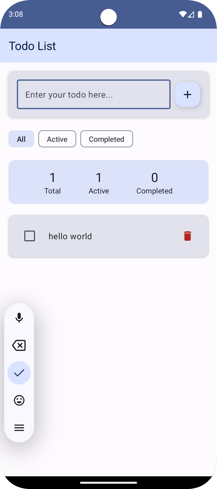

# Todo List Android App

A modern Android Todo List application built with **MVI Architecture** and **Jetpack Compose**.

## Demo

<div align="center">
  
</div>

## Features

- ✅ Add new todo items
- ✅ Mark todo items as completed/incomplete
- ✅ Delete todo items
- ✅ Filter todo items by status (All, Active, Completed)
- ✅ Real-time statistics (Total, Active, Completed counts)
- ✅ Modern Material Design 3 UI
- ✅ Responsive design
- ✅ Database persistence storage
- ✅ Offline data access

## Architecture

This project uses **MVI (Model-View-Intent)** architecture pattern combined with **Repository Pattern**:

- **Model**: Defines application state (`TodoState`) and data models (`TodoItem`)
- **View**: Jetpack Compose UI components
- **Intent**: User interaction intents (`TodoIntent`)
- **ViewModel**: Handles state management and business logic
- **Repository**: Data access layer abstraction, manages local database
- **Database**: Room database provides persistence storage

## Tech Stack

- **Kotlin**: Modern Android development language
- **Jetpack Compose**: Declarative UI toolkit
- **Material Design 3**: Modern design language
- **ViewModel**: State management
- **StateFlow**: Reactive data streams
- **MVI Architecture**: Unidirectional data flow architecture
- **Room Database**: Local database persistence
- **Repository Pattern**: Data access layer abstraction

## Project Structure

```
app/src/main/java/com/example/todolist/
├── data/
│   ├── TodoDao.kt            # Data Access Object
│   ├── TodoDatabase.kt       # Room Database
│   └── TodoRepository.kt     # Data Repository
├── model/
│   ├── TodoItem.kt           # Todo item data model (Room Entity)
│   └── TodoFilter.kt         # Filter enumeration
├── mvi/
│   ├── TodoIntent.kt         # User intents
│   ├── TodoState.kt          # Application state
│   ├── TodoViewModel.kt      # View model
│   └── TodoViewModelFactory.kt # ViewModel factory
├── ui/
│   ├── components/
│   │   ├── TodoItemCard.kt   # Todo item card
│   │   ├── AddTodoInput.kt   # Add todo input
│   │   └── FilterChips.kt    # Filter chips
│   ├── theme/
│   │   ├── Theme.kt          # Theme definition
│   │   ├── Color.kt          # Color definition
│   │   └── Type.kt           # Typography
│   └── TodoScreen.kt         # Main screen
└── MainActivity.kt           # Main activity
```

## How to Run

1. Ensure you have Android Studio and Android SDK installed
2. Clone the project to your local machine
3. Open the project with Android Studio
4. Wait for Gradle sync to complete
5. Run the application

## Requirements

- Android API 24 (Android 7.0)
- Kotlin 1.9.20
- Jetpack Compose

## Usage

### Adding Todo Items
- Enter todo text in the input field at the top
- Click the "+" button or press Enter to add

### Managing Todo Items
- Click the checkbox to mark as completed/incomplete
- Click the delete icon to remove todo items
- Use filter chips to view different status todos

### Statistics
- Real-time display of total, active, and completed counts
- Shows relevant statistics based on current filter

### Data Persistence
- Uses Room database to store all todo items locally
- Automatically syncs database changes to UI
- Supports offline usage, data won't be lost
- Reactive data flow with real-time UI updates

This project demonstrates how to build a fully functional, architecturally sound application using modern Android development technologies, including a complete data persistence solution. 